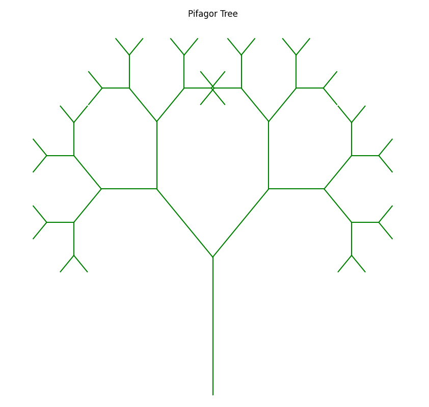
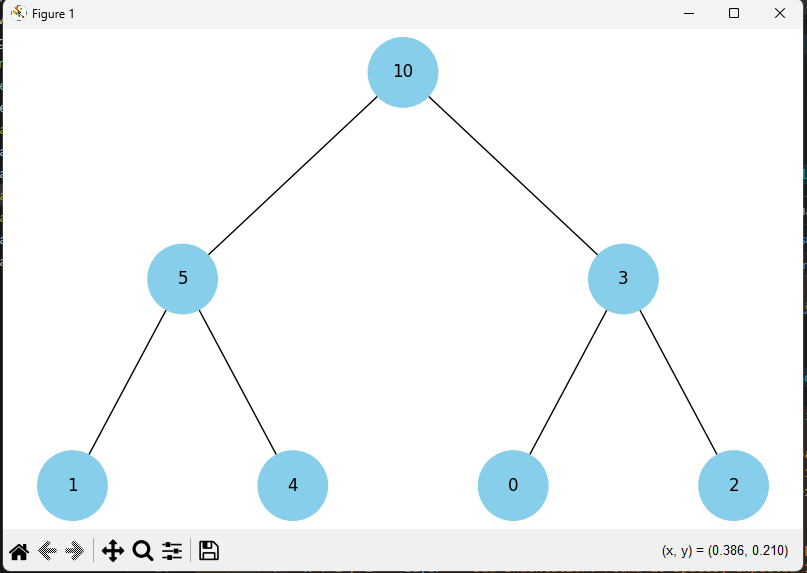
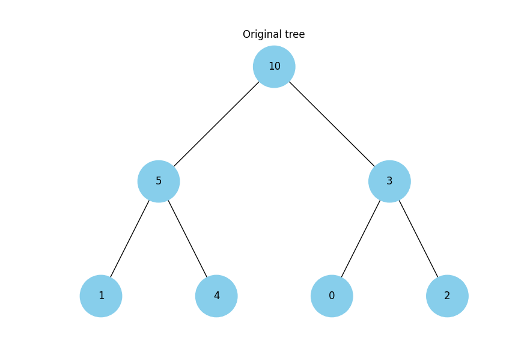
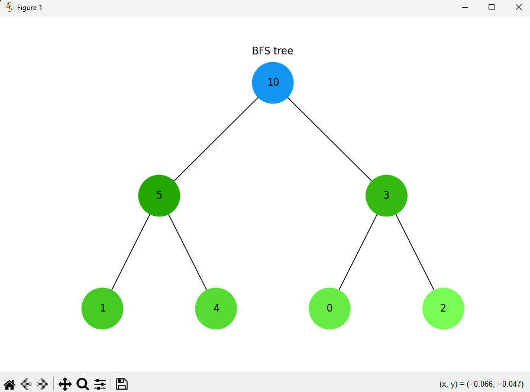
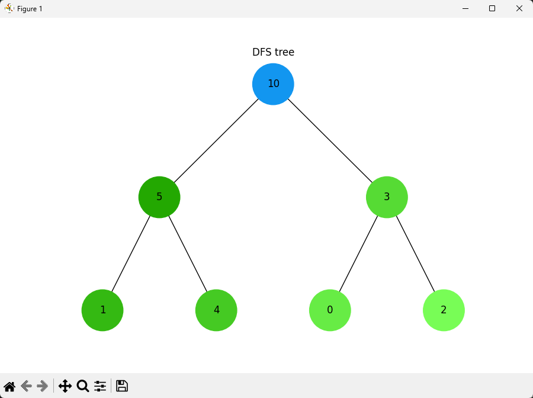

# Task 1

## Task 1-1

Created linked list -> 6 2 1 4 5 10 3  
Reversed linked list -> 3 10 5 4 1 2 6

## Task 1-2

Created bubble sort function -> 1 2 3 4 5 6 10

## Task 1-3

Created merge function for two sorted linked lists  
List 1 : 1 3 5 7 9  
List 2 : 2 4 6 8 10  
Resilt : 1 2 3 4 5 6 7 8 9 10

# Task 2

# Task 3

Result for "Bus Station" : {'Market Square': 5, 'Castle Street': 7, 'City Hospital': 4, 'Bus Station': 0, 'Rakoczi Street': 3, 'Vasarosnameny Road': 8, 'Kisvarda Castle': 12}

# Task 4

# Task 5

# Task 6

Budget: 100  
Greedy algorithm:  
Selected dishes: ['cola', 'potato', 'pepsi', 'hot-dog']  
Total calories: 870

Dynamic programming:  
Selected dishes: ['potato', 'cola', 'pepsi', 'pizza']  
Total calories: 970

A greedy algorithm is faster and uses less memory, but it does not always produce the optimal solution. On the other hand, dynamic programming always returns the optimal solution, but it typically uses more memory and takes more time.

# Task 7

| Sum | 100 simulations | 1000 simulations | 10000 simulations | 100000 simulations |
| --- | --------------- | ---------------- | ----------------- | ------------------ |
| 2   | 5.00 %          | 3.00 %           | 2.79 %            | 2.74 %             |
| 3   | 4.00 %          | 5.00 %           | 5.40 %            | 5.53 %             |
| 4   | 10.00 %         | 7.90 %           | 8.40 %            | 8.40 %             |
| 5   | 7.00 %          | 11.90 %          | 11.01 %           | 11.01 %            |
| 6   | 17.00 %         | 15.10 %          | 14.03 %           | 13.89 %            |
| 7   | 15.00 %         | 16.80 %          | 16.94 %           | 16.63 %            |
| 8   | 13.00 %         | 13.30 %          | 14.40 %           | 13.95 %            |
| 9   | 12.00 %         | 10.60 %          | 10.72 %           | 11.15 %            |
| 10  | 7.00 %          | 7.70 %           | 8.50 %            | 8.33 %             |
| 11  | 6.00 %          | 5.70 %           | 5.25 %            | 5.58 %             |
| 12  | 4.00 %          | 3.00 %           | 2.56 %            | 2.79 %             |

With an increasing number of simulations, the results converge more closely to the analytical data provided in the task.
